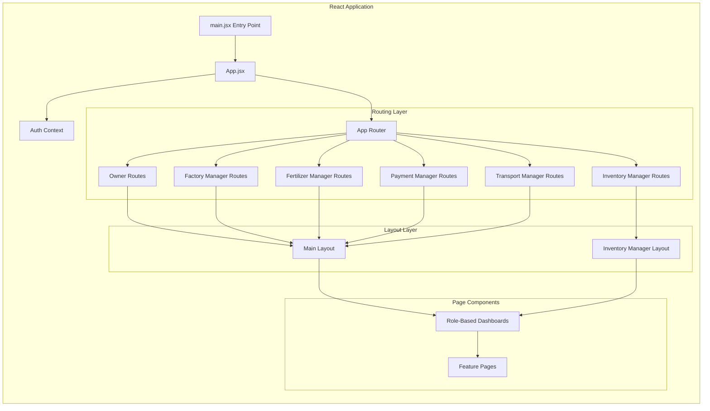
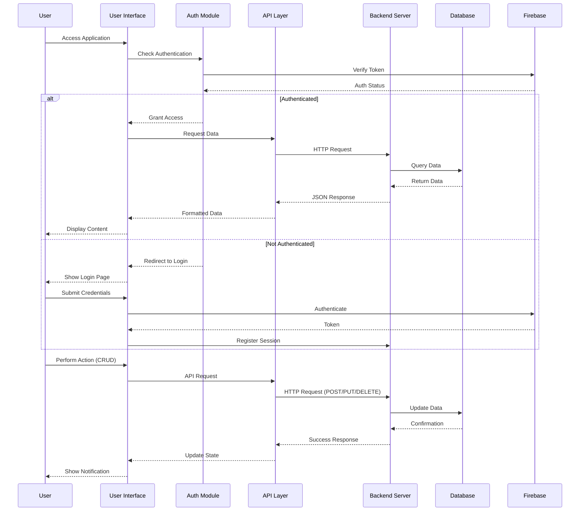
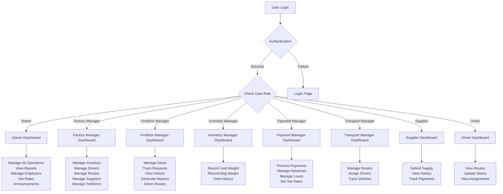
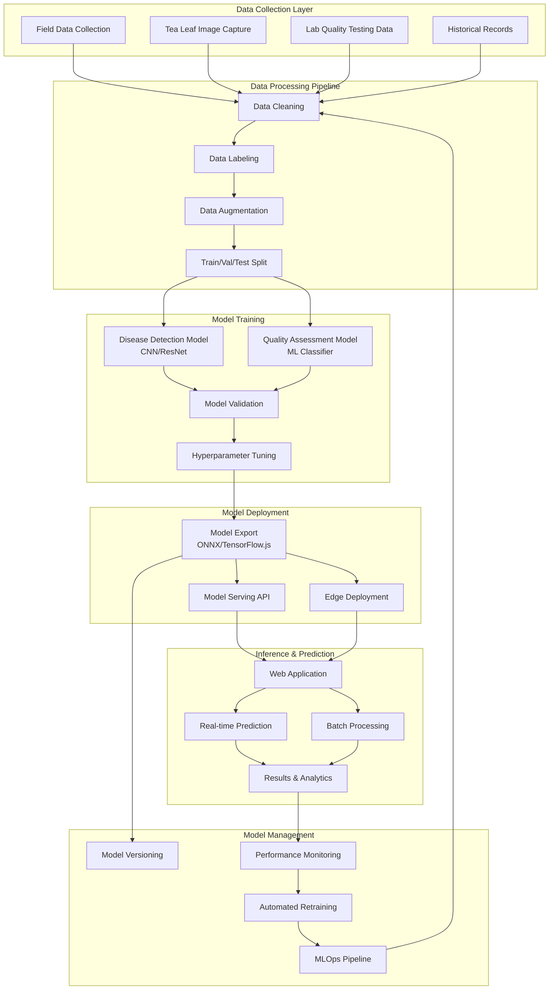
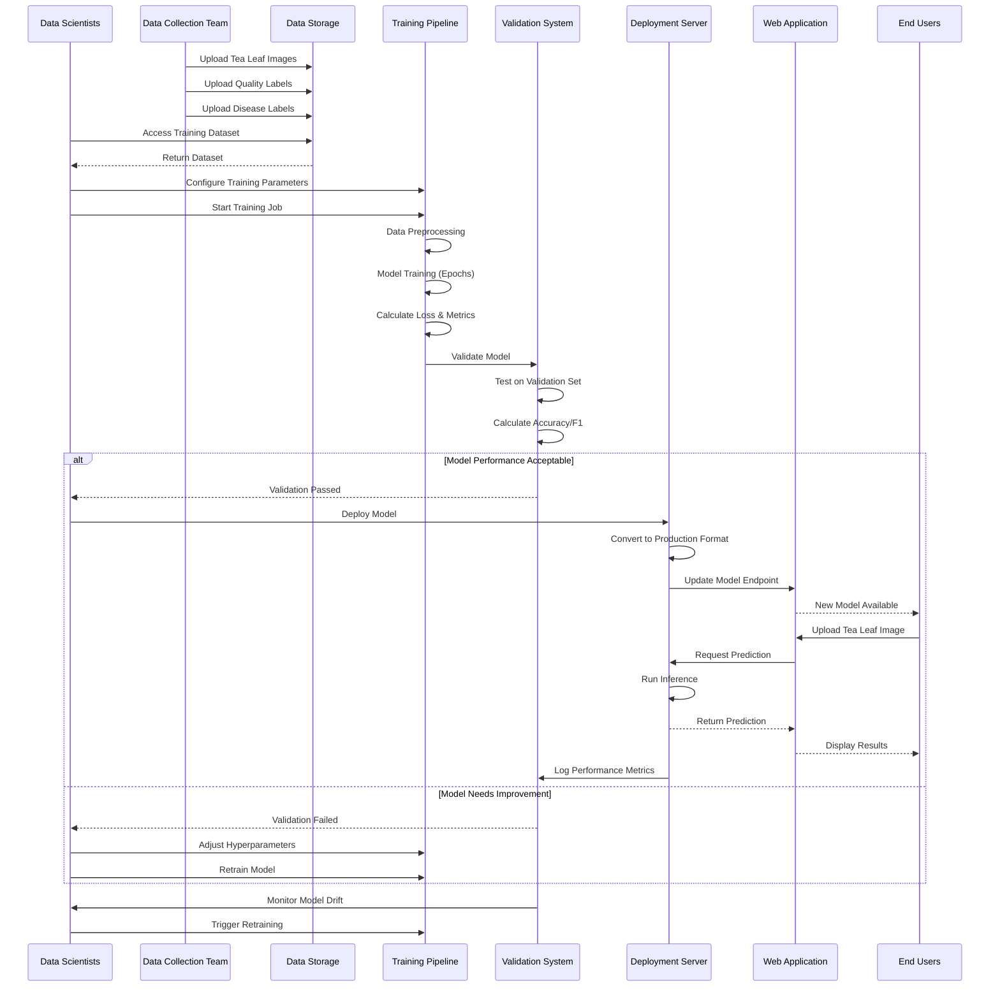
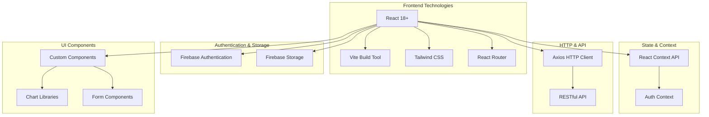

# Tea Factory Management System - Architecture

## High-Level System Architecture

```mermaid
graph TB
    subgraph "Client Layer"
        Browser[Web Browser]
    end
    
    subgraph "Presentation Layer - React Frontend"
        Router[App Router]
        Auth[Authentication Module]
        
        subgraph "User Interfaces"
            OwnerUI[Owner Dashboard]
            FMgrUI[Factory Manager Dashboard]
            FertMgrUI[Fertilizer Manager Dashboard]
            InvMgrUI[Inventory Manager Dashboard]
            PayMgrUI[Payment Manager Dashboard]
            TransMgrUI[Transport Manager Dashboard]
            SupUI[Supplier Dashboard]
            DrvUI[Driver Dashboard]
        end
        
        subgraph "Shared Components"
            Navbar[Navigation Bar]
            Sidebar[Sidebar]
            Charts[Charts & Analytics]
            Notifications[Notifications]
            Profile[Profile Management]
        end
        
        subgraph "Feature Modules"
            Inventory[Inventory Management]
            Payment[Payment Processing]
            Transport[Transport & Routes]
            Fertilizer[Fertilizer Management]
            Supply[Supply Chain]
            Quality[Tea Quality Detection]
            Disease[Disease Detection]
        end
    end
    
    subgraph "Service Layer"
        API[API Service Layer]
        
        subgraph "API Modules"
            AuthAPI[Auth API]
            UserAPI[User API]
            DriverAPI[Driver API]
            SupplierAPI[Supplier API]
            InventoryAPI[Inventory API]
            PaymentAPI[Payment API]
            LoanAPI[Loan API]
            FertilizerAPI[Fertilizer API]
            ManagerAPI[Manager API]
            OwnerAPI[Owner API]
        end
        
        Axios[Axios HTTP Client]
    end
    
    subgraph "External Services"
        Firebase[Firebase Auth & Storage]
        Backend[Backend REST API Server]
    end
    
    subgraph "Data Layer"
        Database[(Database)]
    end
    
    Browser --> Router
    Router --> Auth
    Auth --> Firebase
    
    Router --> OwnerUI
    Router --> FMgrUI
    Router --> FertMgrUI
    Router --> InvMgrUI
    Router --> PayMgrUI
    Router --> TransMgrUI
    Router --> SupUI
    Router --> DrvUI
    
    OwnerUI --> Shared Components
    FMgrUI --> Shared Components
    FertMgrUI --> Shared Components
    InvMgrUI --> Shared Components
    PayMgrUI --> Shared Components
    TransMgrUI --> Shared Components
    SupUI --> Shared Components
    DrvUI --> Shared Components
    
    OwnerUI --> Feature Modules
    FMgrUI --> Feature Modules
    FertMgrUI --> Feature Modules
    InvMgrUI --> Feature Modules
    PayMgrUI --> Feature Modules
    TransMgrUI --> Feature Modules
    SupUI --> Feature Modules
    DrvUI --> Feature Modules
    
    Feature Modules --> API
    Shared Components --> API
    
    API --> Axios
    Axios --> Backend
    Axios --> Firebase
    
    Backend --> Database
    Firebase --> Database
```

## Component Architecture



## Data Flow Diagram



## User Role Flow



## ML Model Training Architecture



## ML Model Training Workflow



## Technology Stack



## ML Models & AI Features

### 1. **Tea Disease Detection Model**

**Architecture**: Convolutional Neural Network (CNN) / ResNet-50

**Purpose**: Identify diseases and pest infestations in tea leaves from images

**Training Process**:
```
1. Data Collection
   - Collect 10,000+ tea leaf images
   - Categories: Healthy, Blister Blight, Gray Blight, Red Rust, Anthracnose
   - Field photos with varying lighting conditions

2. Data Preprocessing
   - Image resizing (224x224 or 299x299)
   - Normalization (0-1 scale)
   - Data augmentation: rotation, flip, zoom, brightness adjustment
   - Train/Val/Test split: 70/15/15

3. Model Training
   - Base Model: Pre-trained ResNet-50 or EfficientNet
   - Transfer Learning: Fine-tune top layers
   - Loss Function: Categorical Cross-Entropy
   - Optimizer: Adam (lr=0.001)
   - Batch Size: 32
   - Epochs: 50-100 with early stopping
   - Data Augmentation: Online during training

4. Evaluation Metrics
   - Accuracy: >95%
   - Precision/Recall per class
   - F1-Score
   - Confusion Matrix

5. Model Export
   - TensorFlow.js for web deployment
   - ONNX for cross-platform compatibility
   - Model quantization for mobile devices
```

**Deployment**:
- Client-side inference using TensorFlow.js
- Server-side API for batch processing
- Real-time prediction in browser (<2 seconds)
- Confidence scores for each disease class

**Features in UI**:
- Image upload interface
- Real-time camera capture
- Disease probability visualization
- Treatment recommendations
- Historical detection records

### 2. **Tea Quality Assessment Model**

**Architecture**: Multi-class Classification (Random Forest / XGBoost / Neural Network)

**Purpose**: Predict tea quality grade based on multiple factors

**Input Features**:
- Leaf appearance (color, texture, size)
- Physical measurements (weight, moisture content)
- Processing parameters (withering time, fermentation level)
- Chemical composition (polyphenols, caffeine)
- Origin and harvesting data
- Weather conditions during growth

**Training Process**:
```
1. Feature Engineering
   - Numerical features: standardization (z-score)
   - Categorical features: one-hot encoding
   - Feature selection: correlation analysis, feature importance
   - Handle missing values: imputation or removal

2. Model Selection
   - Test multiple algorithms:
     * Random Forest Classifier
     * Gradient Boosting (XGBoost, LightGBM)
     * Neural Network (MLP)
     * Support Vector Machine
   - Cross-validation (5-fold)
   - Select best performing model

3. Training Configuration
   - Train/Test split: 80/20
   - Hyperparameter tuning: Grid Search or Bayesian Optimization
   - Handle class imbalance: SMOTE or class weights
   - Regularization to prevent overfitting

4. Quality Classes
   - Premium Grade (90-100 points)
   - High Grade (80-89 points)
   - Standard Grade (70-79 points)
   - Low Grade (<70 points)

5. Evaluation
   - Classification accuracy
   - Multi-class AUC-ROC
   - Precision-Recall curves
   - Feature importance analysis
```

**Deployment**:
- REST API endpoint for quality prediction
- Batch processing for inventory assessment
- Real-time scoring during inspection
- Integration with inventory management

**Features in UI**:
- Input form for quality parameters
- Automated quality scoring
- Quality trend analysis over time
- Grade distribution charts
- Quality reports and exports

### 3. **ML Pipeline & MLOps**

**Data Management**:
- Firebase Storage for image datasets
- Cloud database for structured training data
- Version control for datasets (DVC)
- Automated data validation

**Training Infrastructure**:
- Cloud GPU instances (AWS/GCP) for training
- Jupyter Notebooks for experimentation
- Automated training pipelines
- Experiment tracking (MLflow, Weights & Biases)

**Model Versioning**:
- Semantic versioning (v1.0.0, v1.1.0)
- Model registry with metadata
- A/B testing for new models
- Rollback capability

**Monitoring & Maintenance**:
- Prediction confidence tracking
- Model performance metrics dashboard
- Data drift detection
- Automated retraining triggers
- User feedback collection

**Continuous Improvement**:
```
1. Collect user feedback on predictions
2. Gather new labeled data quarterly
3. Retrain models with expanded dataset
4. Validate improved performance
5. Deploy updated models
6. Monitor production performance
```

### 4. **AI-Assisted Features**

**Predictive Analytics**:
- Supply forecasting based on historical patterns
- Payment prediction models
- Route optimization using historical data
- Inventory demand forecasting

**Recommendation Systems**:
- Optimal fertilizer recommendations
- Best harvesting time suggestions
- Quality improvement recommendations
- Supplier performance predictions

**Anomaly Detection**:
- Unusual supply patterns
- Payment fraud detection
- Inventory discrepancies
- Quality anomalies

## Module Breakdown

### 1. **Authentication Module**
- Firebase Authentication integration
- Login/Signup flows
- Password recovery
- Session management
- Role-based access control

### 2. **Owner Module**
- Complete system oversight
- Employer management
- Payment approvals
- Rate setting (Tea & Fertilizer)
- System-wide announcements
- Comprehensive reporting
- Supplier & company management

### 3. **Factory Manager Module**
- Dashboard with key metrics
- Inventory oversight
- Driver management
- Route planning
- Supplier coordination
- Fertilizer management

### 4. **Fertilizer Manager Module**
- Stock management
- Request processing
- Distribution tracking
- Driver route coordination
- History & reporting

### 5. **Inventory Manager Module**
- Leaf weight recording
- Bag weight recording
- Inventory history tracking
- Real-time updates

### 6. **Payment Manager Module**
- Payment processing
- Advance management
- Loan administration
- Tea rate management
- Payment history & reports

### 7. **Transport Manager Module**
- Route management
- Driver assignment
- Vehicle tracking
- Schedule coordination

### 8. **Supplier Module**
- Tea supply submission
- Supply history
- Payment tracking
- Performance metrics

### 9. **Driver Module**
- Route assignments
- Status updates
- Delivery tracking
- Schedule viewing

## Data Flow Patterns

### 1. **Create/Update Flow**
```
User Input → Form Validation → API Call → Backend Processing → Database Update → 
Success Response → UI Update → Notification → State Refresh
```

### 2. **Read/Display Flow**
```
Page Load → API Request → Backend Query → Database Fetch → Data Transform → 
API Response → State Update → Component Render
```

### 3. **Authentication Flow**
```
Login Form → Firebase Auth → Token Generation → Backend Verification → 
Role Assignment → Context Update → Route Redirect → Dashboard Load
```

### 4. **Real-time Updates Flow**
```
Action Trigger → API Call → Database Update → Notification Service → 
UI Notification → Auto-refresh → Updated Display
```

## Key Features

- **Role-Based Access Control (RBAC)**: Different interfaces for 8 user roles
- **Real-time Notifications**: System-wide notification system
- **Analytics & Reporting**: Charts and data visualization
- **Inventory Tracking**: Real-time leaf and bag weight management
- **Payment Processing**: Comprehensive payment, advance, and loan management
- **Supply Chain Management**: End-to-end tracking from supplier to factory
- **AI-Powered Quality Control**: ML-based tea quality assessment and disease detection
- **Disease Detection AI**: CNN-based image recognition for tea leaf diseases
- **Predictive Analytics**: ML models for forecasting and optimization
- **Route Optimization**: Transport and delivery route management
- **Document Management**: Firebase storage for files and images
- **MLOps Integration**: Continuous model training and deployment pipeline

## Security Considerations

- Firebase Authentication for secure user management
- Token-based session management
- Role-based route protection
- API authentication headers
- Secure data transmission (HTTPS)
- Input validation and sanitization

## Scalability Features

- Modular component architecture
- Lazy loading of routes
- Code splitting with Vite
- API abstraction layer
- Reusable component library
- Centralized state management
- Distributed ML model serving
- Edge computing for inference
- Scalable training infrastructure
- Automated model retraining pipeline
- Caching strategies for predictions
- Load balancing for API endpoints
